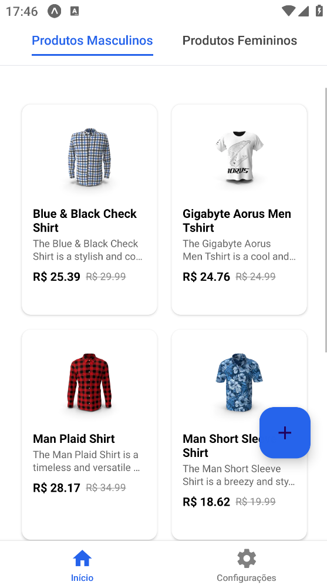
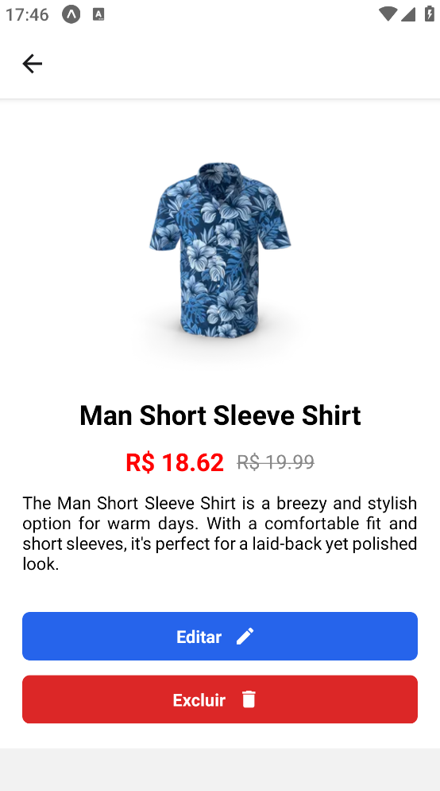
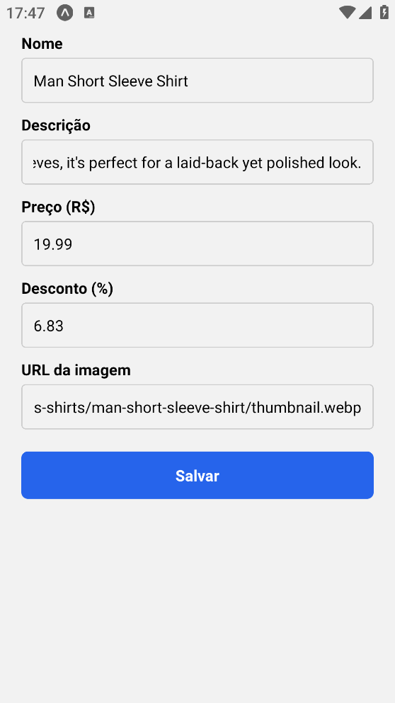
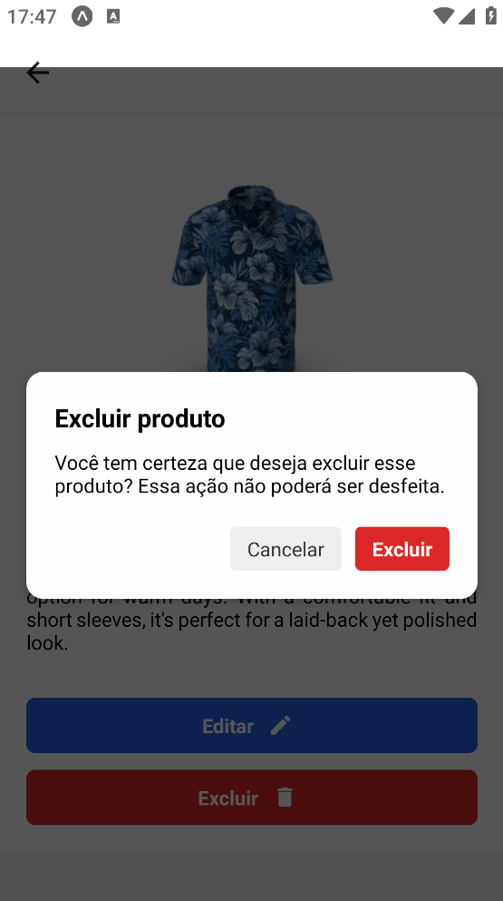
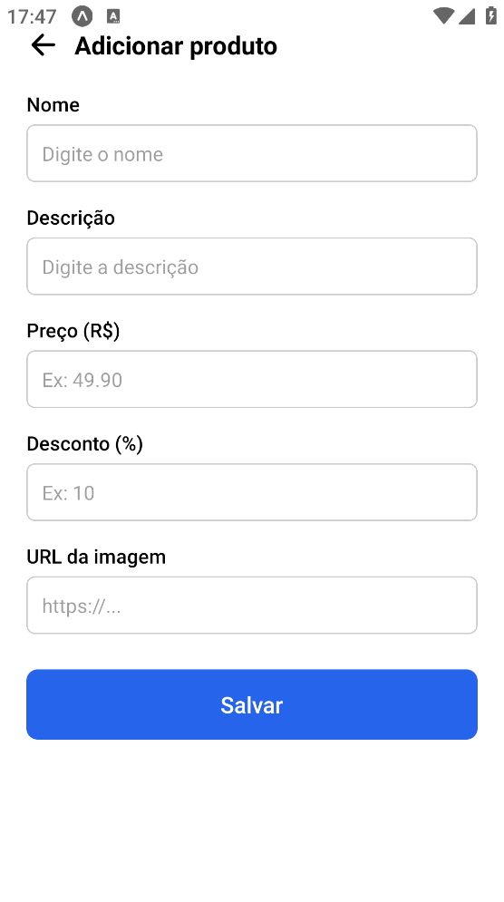

# 📱 Catálogo de Produtos - React Native (Expo)

Este é um aplicativo mobile desenvolvido com **React Native** utilizando **Expo** para simular um catálogo de produtos. Ele foi criado como parte do trabalho prático da disciplina *Mobile Development* do curso de Análise e Desenvolvimento de Sistemas da UniFecaf.

---

## 📌 Funcionalidades

✔️ Tela de Login com validação e armazenamento temporário de dados  
✔️ Listagem de produtos separados por **categorias/abas**: masculino e feminino  
✔️ Tela de detalhes com: imagem, nome, descrição, preço original e preço com desconto  
✔️ Navegação entre telas via React Navigation  
✔️ Logout funcional com modal de confirmação  
✔️ Integração com API externa: [DummyJSON](https://dummyjson.com/products)  
✔️ Estilização moderna com `StyleSheet` do React Native  
✔️ Boas práticas de organização em pastas (`screens`, `components`, `navigation`, etc)  
✔️ Gerenciamento de estado com **Redux Toolkit**  
✔️ Código limpo, comentado e estruturado  

---

## 🚀 Tecnologias Utilizadas

- [React Native](https://reactnative.dev/)
- [Expo](https://expo.dev/)
- [Axios](https://axios-http.com/)
- [Redux Toolkit](https://redux-toolkit.js.org/)
- [React Navigation](https://reactnavigation.org/)
- [React Native Paper (FAB)](https://callstack.github.io/react-native-paper/)
- [DummyJSON API](https://dummyjson.com/)

---

## 📁 Estrutura do Projeto
```bash
📂 src
┣ 📂 assets         → Imagens e arquivos estáticos
┣ 📂 components      → Componentes reutilizáveis
┣ 📂 navigation      → Configuração das rotas (AppNavigator, Tabs, etc)
┣ 📂 redux           → Store e slices (Redux Toolkit)
┣ 📂 screens         → Telas (Login, Home, Detalhes, Configurações, etc)
┣ 📂 services        → Serviços externos como requisições via Axios
┗ 📜 app.js          → Entrada principal do app
```


  
---

## 🛠️ Como Instalar e Executar

> Siga as instruções abaixo para rodar o projeto localmente

### 1. Clone o repositório

```bash
git clone https://github.com/Kaio-with-K/Mobile_Development_Kaio_71216.git
```

### 2. Acesse a pasta

```bash
cd Mobile_Development_Kaio_71216
```

### 3. Instale as dependências node

```bash
npm install
# instale o expo também
npm install -g expo-cli
```

### 📲 Executando o app

Com tudo instalado, rode o app com:

```bash
npx expo start
```

Esse comando abrirá o Metro Bundler no navegador. Você pode:

- Pressionar a para rodar no Android.
- Pressionar w para rodar no navegador (web).

Usar o app Expo Go no seu celular e escanear o QR Code gerado.

### 📚 Principais Dependências
Essas são as bibliotecas utilizadas no projeto:
| Pacote                           | Função                                         |
| -------------------------------- | ---------------------------------------------- |
| `expo`                           | Plataforma para desenvolvimento mobile         |
| `react-native`                   | Framework principal                            |
| `axios`                          | Requisições HTTP à API                         |
| `@reduxjs/toolkit`               | Gerenciamento de estado com Redux Toolkit      |
| `react-redux`                    | Integração Redux com React                     |
| `@react-navigation/native`       | Navegação entre telas                          |
| `@react-navigation/native-stack` | Navegação tipo Stack                           |
| `@react-navigation/bottom-tabs`  | Navegação com abas inferiores                  |
| `react-native-safe-area-context` | Ajuste seguro para diferentes tamanhos de tela |
| `react-native-vector-icons`      | Ícones personalizáveis no app                  |
| `react-native-paper`             | Componentes prontos com estilo Material        |

### 🖼️ Prints do Aplicativo

### 🖼️ Prints do Aplicativo

| 🔐 Login | 🏠 Inicial | 🛍️ Detalhes |
|:--:|:--:|:--:|
|  |  |  |

| ✏️ Edição | 🗑️ Exclusão | ➕ Cadastro |
|:--:|:--:|:--:|
|  |  |  |

| ⚙️ Configurações |  |  |
|:--:|:--:|:--:|
|  |  |  |


### 👨‍💻 Autor
- Kaio de Jesus Santana
- RA: 71216
- Curso: Análise e Desenvolvimento de Sistemas
- Instituição: UniFecaf
